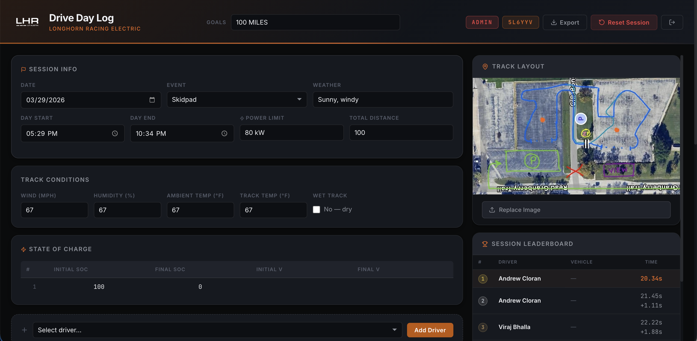
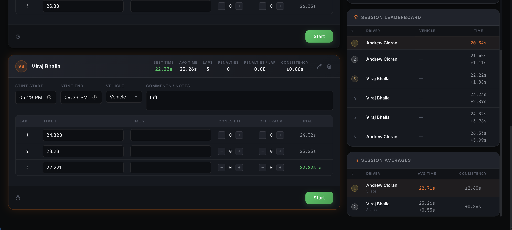

# Longhorn Racing Drive Day Log

A web-based tool for recording and analyzing drive day performance, now with **live multi-user sessions and role-based access control**.

## 🌐 Official Tool
This tool is maintained by Longhorn Racing and is available at:

https://driveday.lhre.org

## 📸 Preview

## 🎯 Purpose
- This tool standardizes how drive day data is recorded and analyzed across the team.  
- It replaces inconsistent spreadsheets and ensures reliable, structured data collection.

## 🚀 Features
- Driver-based lap tracking
- Automatic lap creation
- Best & average time calculations
- Penalty system:
  - +2s per cone
  - +20s per missed gate
- Session metadata:
  - Event type (Skidpad, Autocross, Endurance, Kart)
  - Weather & track conditions
  - Start/end times
  - Total distance
- Tire data logging
- State of Charge (SOC) tracking
- Track image upload
- Local persistence
- Advanced driver statistics (consistency, penalties, penalties per lap)
- Session leaderboard for quick driver comparison
- Session-wide averages for performance analysis
- Export run sheet as formatted PDF for sharing and archiving

## 🏁 Drive Day Workflow
1. Add drivers
2. Record laps (live or manual)
3. Input penalties during laps
4. Fill in session metadata
5. Export

## 🧠 Timing Logic
- If one lap is entered, used directly
- If two laps are entered, average is used
- Penalties are applied after base time calculation

$$Final Time = baseTime + (2 \times cones) + (20 \times offtrack)$$

## ⚠️ Data Storage
- Data is now stored in Firebase (cloud)
- Sessions are shared across devices in real-time
- Internet connection required

## 🏗️ Architecture
- Frontend: React + TypeScript (Vite)
- Backend: Firebase Firestore (real-time database)
- Deployment: Vercel

The system uses a session-based architecture where:
- A host creates a session
- Others join via code
- All updates sync instantly via Firestore listeners

## 📜 Changelog
See [CHANGELOG.md](./CHANGELOG.md) for full version history.

## 👥 Maintainers
Nathan Yee (Trackside Engineering)

## 📦 Version
Current version: 2.1.3